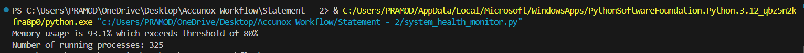

# Scripts--Accuknox
## Problem Statement - 2
## Title : Please choose any two objectives from the list below and attempt to achieve them using either Bash or Python.


## Getting Started

To run this on your local machine, follow these steps:

1. **Required:**
  1. Install Libraries
     
```bash
pip install psutil
pip install requests
```
  2. Any code editor - VS Code, Atom

2. **1.	System Health Monitoring Script:**
Objective: 
Develop a script that monitors the health of a Linux system. It should check CPU usage, memory usage, disk space, and running processes. If any of these metrics exceed predefined thresholds (e.g., CPU usage > 80%), the script should send an alert to the console or a log file.



3. **Application Health Checker: **
Objective:
Please write a script that can check the uptime of an application and determine if it is functioning correctly or not. The script must accurately assess the application's status by checking HTTP status codes. It should be able to detect if the application is 'up', meaning it is functioning correctly, or
'down', indicating that it is unavailable or not responding.


